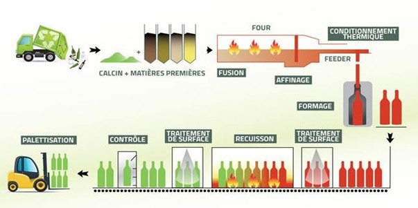
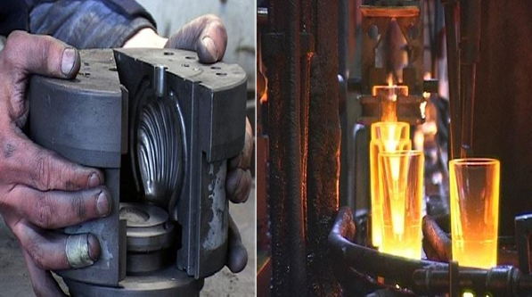
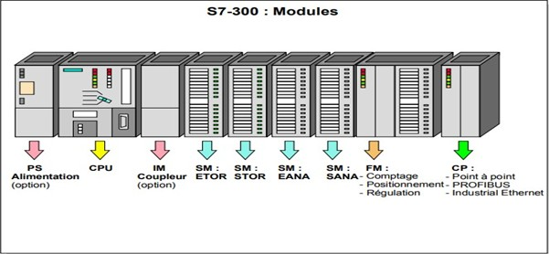
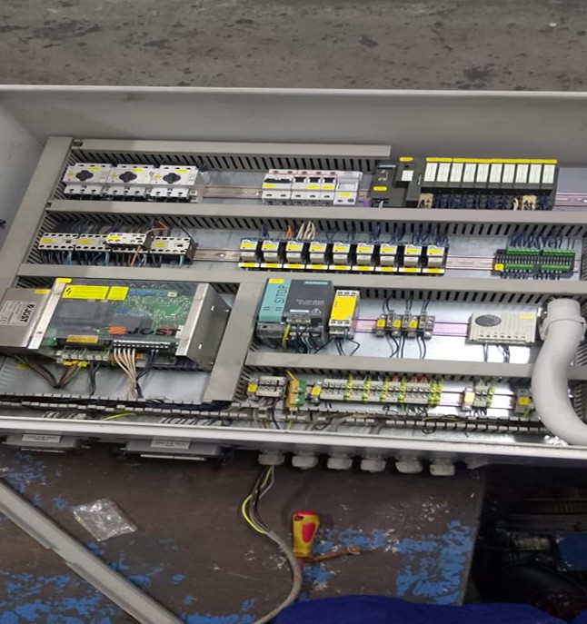
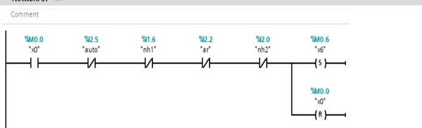
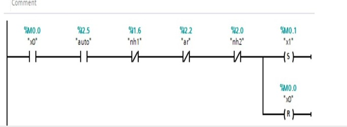
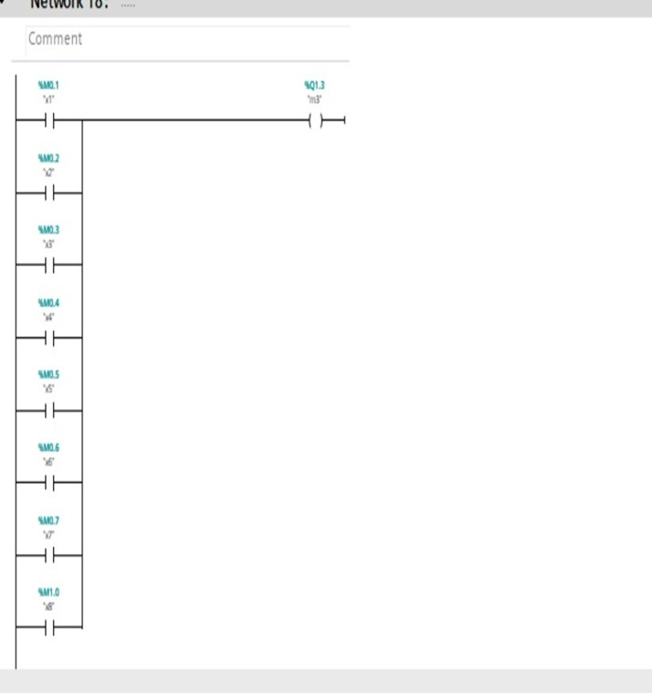
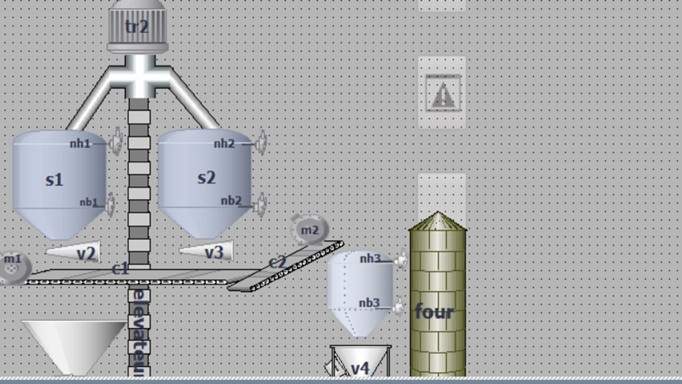
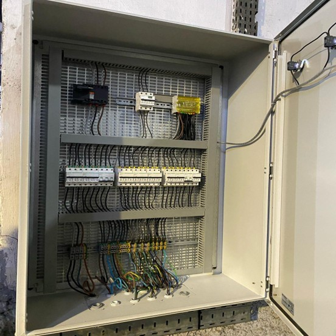
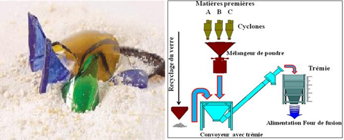

# 🏭 Intelligent Automation & Control of Industrial Glass-Feeding Systems
**End of Study Project (PFE) | SEVAM (Société d’Exploitation de Verreries au Maroc)**
**Academic Year: 2024–2025 | Industrial Automation & Electrical Engineering**

---

## 📑 Project Executive Summary
This project represents a comprehensive industrial study and implementation focused on the automation of the raw material feeding cycle at **SEVAM**. The core objective was to replace traditional manual control with a high-reliability, sensor-integrated architecture driven by a **Siemens S7-300 PLC**. By optimizing the synchronization between the vibrating hopper and the melting furnace, the system ensures a continuous production flow, maximizes equipment longevity, and provides superior safety interlocks for the industrial environment.

---

## 🏗️ 1. Industrial Context: The Glass Manufacturing Cycle
The automation of the hopper is a critical node within the larger glass fabrication process. This cycle begins with the melting of raw materials (silica, soda ash, and lime) and follows a rigorous path to achieve the final product quality.

   *Figure 1: Comprehensive flowchart of the industrial glass manufacturing stages.*

### 1.1 Melting & Molding Operations
The raw material is fed into the furnace, where it undergoes fusion at extreme temperatures. Once molten, the glass is moved to the molding phase to take its final form.

  
  

<i>Figure 2 & 3: Precision molding process (left) and internal furnace thermal environment (right).</i>

---

## 🛠️ 2. Hardware Architecture & Control Components
Designing for a high-vibration and high-temperature environment required a strategic selection of industrial-grade hardware.

### 2.1 The Control Core: Siemens S7-300
The logic backbone is a **Siemens S7-300 PLC**, chosen for its modularity and robust performance in heavy industrial applications. It manages the real-time processing of sensor signals to coordinate the vibrating motors.

  *Figure 4: Central Processing Unit - Siemens S7-300 PLC.*

### 2.2 Specialized Motor Interfacing
To bridge the gap between low-voltage PLC logic and the power demands of the vibration system, a specialized electronic interface board was utilized to regulate high-torque motor activation.

  *Figure 5: Custom interface board for vibrating motor drive synchronization.*

---

## ⚙️ 3. Software Engineering & Supervision
The project utilized the **Siemens SIMATIC** environment to develop the control logic and the **WinCC** platform for industrial supervision.

### 3.1 Ladder Diagram (LD) Implementation
The control sequences were developed using **Ladder Logic**, structured into modular networks to ensure clear functional separation and ease of maintenance.

  *Figures 6, 7, & 8: Technical implementation of the automation sequences in Ladder Diagram.*

### 3.2 HMI & Industrial Supervision (WinCC)
A Human-Machine Interface (HMI) was developed via **SIMATIC WinCC**, allowing operators to monitor the system status, view real-time alarms, and control the process flow through a digitized dashboard.

  *Figure 9: WinCC Supervision dashboard for real-time process monitoring.*

---

## ⚡ 4. Electrical Engineering & Design
A fundamental deliverable of this PFE was the complete electrical study, encompassing power distribution and control signal integrity.

### 4.1 Electrical Schematics
The system utilizes a dual-circuit design:
* **Power Circuit:** Designed for 400V AC distribution to handle the inductive loads of the vibrating motors.
* **Control Circuit:** 24V DC logic for PLC I/O, safety loops, and indicator lamps.

  
  

<i>Figure 10 & 11: High-voltage Power Circuit (left) and 24VDC Control Schematic (right).</i>

### 4.2 Cabinet Realization
The study concluded with the physical assembly of the industrial control cabinet, ensuring compliance with international electrical standards for isolation and thermal protection.

*Figure 12: Final assembly of the industrial electrical control cabinet.*

---

## 📊 5. Functional Process Flow
The final automation solution operates as a closed-loop system, precisely regulating the material input based on furnace demand.

*Figure 13: Functional process flow of the automated feeding cycle.*

---

## 🤝 Project Team & Institutional Support
* [cite_start]**Lead Project Engineer:** Mohamed Amine Ouklilane [cite: 8]
* [cite_start]**Industrial Partner:** SEVAM (Société d’Exploitation de Verreries au Maroc) [cite: 3, 44]
* [cite_start]**Supervising Institution:** Hassan II University - EST Casablanca [cite: 1, 2]

---

### 📄 Documentation
[👉 Access the Complete Technical PFE Report (PDF)](.Reports/Rapport de SFE.pdf)
